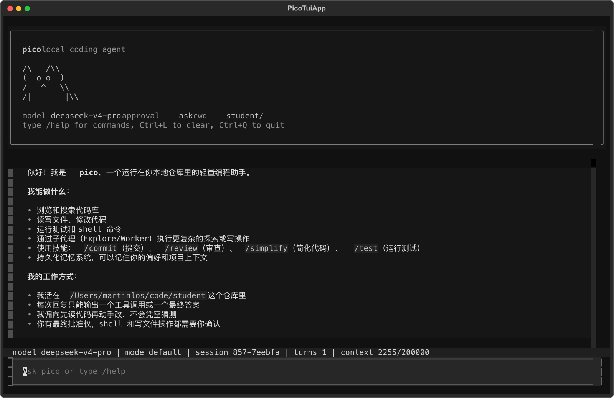
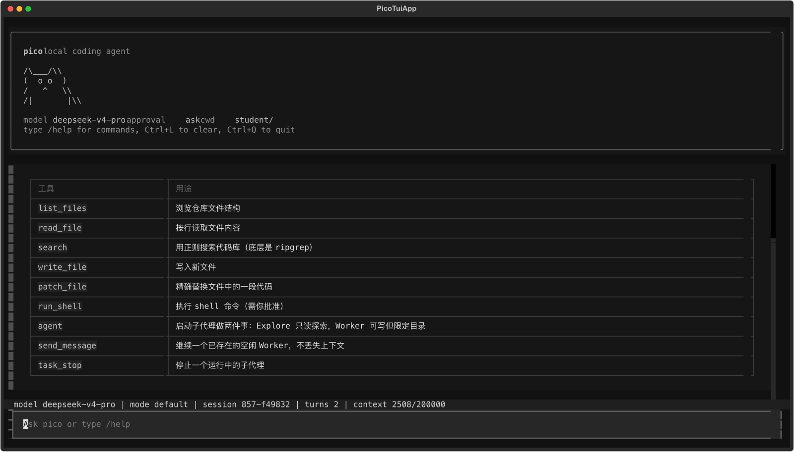
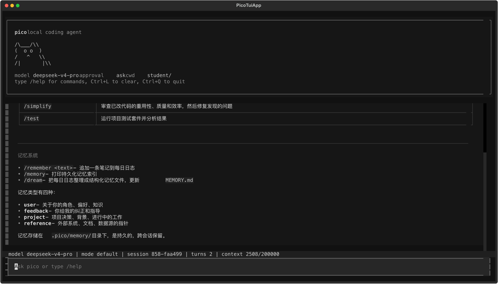
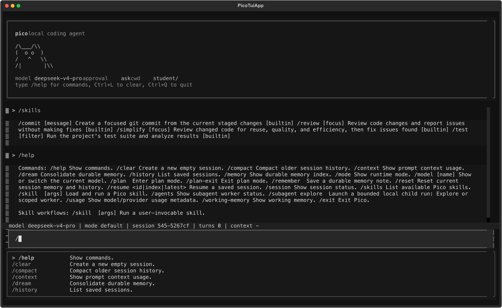

<div align="center">

# PatchFox

**轻量、本地、有记忆的终端 coding agent**

PatchFox 跑在本地仓库里，接上一个模型 provider，就能读代码、跑命令、改文件、
保留运行证据，并把有价值的上下文沉淀成本地记忆。

</div>

<p align="center">
  
</p>

---

## PatchFox 是什么

PatchFox 是一个本地终端里的 coding agent，运行在你的仓库上下文里。一次 agent 运行会被拆成几个可观察的部分：

- **provider profile**：决定调用哪个模型、哪个 endpoint、用什么协议。
- **context**：把系统提示、仓库信息、skills、记忆和最近对话装进 prompt。
- **tools**：文件读取、搜索、shell、写文件、patch、子 agent 都走统一工具协议。
- **approval / sandbox**：写操作和 shell 命令可以被审批或沙箱限制。
- **session / run evidence**：对话、事件流、trace、report 都写到本地 `.patchfox/`。
- **memory / dream**：把 daily log 整理成长期 topic，下次 session 可以继续用。

PatchFox 关注本地 coding agent 的工程边界：配置清楚、任务能续接、结果能复盘。

## 界面

TUI 直接连接同一个 runtime。输入框、工具结果、状态栏、slash command 和补全都来自当前 session。

| 工具和子 agent | Skills、help 和命令补全 |
| --- | --- |
|  |  |

| Memory 和 durable topics | Slash command 工作区 |
| --- | --- |
|  |  |

## 安装

要求：Python 3.10+，以及至少一个可用的模型 provider key。

一键安装：

```bash
curl -fsSL https://raw.githubusercontent.com/martin-los/patchfox/main/install.sh | bash
```

源码安装：

```bash
git clone https://github.com/martin-los/patchfox.git
cd patchfox
pip install -e .
```

开发 checkout 里也可以直接跑：

```bash
uv run patchfox
```

## 配置 provider

PatchFox 使用用户级全局配置。第一次直接运行 `patchfox` / `patchfox-tui` 会进入设置
向导，也可以提前执行：

```bash
patchfox config init
patchfox config show
```

配置分开保存：

| 文件 | 内容 |
| --- | --- |
| `~/.patchfox/config.toml` | Provider、协议、Base URL 和默认模型，不含密钥。 |
| `~/.patchfox/auth.json` | Provider API Key。 |
| `~/.patchfox/projects.json` | 不同项目选择的 Provider 和模型。 |

切换到任意代码目录后可以直接运行 PatchFox，不需要给该项目复制 `.env`：

```powershell
cd F:\project\demo
patchfox-tui
```

TUI / REPL 内可立即切换并保存该项目的选择：

```text
/provider openai
/model gpt-5.4
```

项目 `.patchfox.toml` 只能提供 `provider`、`model` 和 shell/sandbox 等本地行为配置；
其中的 API Key、Base URL、协议和 `[providers.*]` 会被忽略，防止不可信项目重定向
全局密钥。

### 环境变量

环境变量继续用于 CI 或临时覆盖，但项目 `.env` 不会被 PatchFox 自动加载：

```bash
export PATCHFOX_PROVIDER=deepseek
export DEEPSEEK_API_KEY=sk-...
patchfox
```

常用 provider 变量：

| Provider | 变量 |
| --- | --- |
| DeepSeek | `DEEPSEEK_API_KEY`, `DEEPSEEK_BASE_URL`, `DEEPSEEK_MODEL` |
| OpenAI-compatible | `OPENAI_API_KEY`, `OPENAI_BASE_URL`, `OPENAI_MODEL` |
| Anthropic-compatible | `ANTHROPIC_API_KEY`, `ANTHROPIC_BASE_URL`, `ANTHROPIC_MODEL` |

也可以用通用覆盖变量：

```bash
export PATCHFOX_API_KEY=sk-...
export PATCHFOX_BASE_URL=https://api.openai.com/v1
export PATCHFOX_MODEL=gpt-5.4
```

### 命令行临时覆盖

临时换 provider 或模型：

```bash
patchfox --provider openai --model gpt-5.4 --base-url https://api.openai.com/v1
patchfox --provider deepseek --approval ask --max-steps 80
patchfox --config /path/to/custom.toml --cwd /path/to/repo
```

## 启动

常用入口：

```bash
patchfox                              # 默认 Textual TUI
patchfox --repl                       # 普通终端 REPL
patchfox "找出测试失败的根因"          # one-shot 任务
patchfox --resume latest              # 续接最近 session
patchfox --cwd /path/to/repo          # 指定工作目录
```

常用运行参数：

```bash
patchfox --approval ask               # shell / 写文件前询问
patchfox --approval auto              # 普通操作自动通过
patchfox --approval never             # 非交互模式
patchfox --sandbox best_effort        # 尽量隔离 shell 命令
patchfox --shell auto                 # Windows: Git Bash → PowerShell → CMD
patchfox --shell powershell           # 强制使用 PowerShell 方言
patchfox --no-auto-dream              # 关闭后台 memory 整合
```

`run_shell` 使用显式 Shell Backend，不再依赖 Python 在各平台对 `shell=True` 的隐式选择。Windows 原生运行不要求 WSL；如果已安装 Git for Windows，`auto` 会优先使用 Git Bash。

## 日常用法

进入 TUI 或 REPL 后可以直接输入自然语言，也可以用 slash command：

```text
> /help
> /skills
> 找出测试失败的根因
> /plan 重构 provider 配置加载逻辑
> /review
> /test tests/test_config.py
> /remember 这个项目用 DeepSeek 的 Anthropic-compatible endpoint
> /dream
```

常用命令：

| 命令 | 作用 |
| --- | --- |
| `/help` | 查看内置命令。 |
| `/skills` | 列出可用 skills。 |
| `/session` | 查看当前 session、events、run 路径。 |
| `/history` | 列出历史 session。 |
| `/resume latest` | 续接最近 session。 |
| `/context` | 查看 prompt context 使用情况。 |
| `/usage` | 查看 provider、model、token 元数据。 |
| `/memory` | 查看 durable memory 索引。 |
| `/working-memory` | 查看当前 session 工作记忆。 |
| `/remember <text>` | 保存一条 durable note 到 daily log。 |
| `/dream` | 把 daily log 整合成 durable memory topics。 |
| `/plan <topic>` | 进入 plan mode。 |
| `/plan-exit` | 退出 plan mode。 |
| `/agents` | 查看子 agent 状态。 |
| `/model <name>` | 当前 session 临时切模型。 |
| `/compact` | 压缩较早的对话历史。 |
| `/clear` | 开一个新的空 session。 |
| `/exit` | 退出 patchfox。 |

## PatchFox 能做什么

| 能力 | 说明 |
| --- | --- |
| TUI / REPL / one-shot | 同一个 runtime，通过不同入口使用。 |
| 工具执行 | 文件列表、读文件、搜索、shell、写文件、patch、ask_user、子 agent、todo。 |
| Plan mode | 先读代码和拆计划，再进入可写执行阶段。 |
| 子 agent | 启动 bounded Explore / Worker 任务。 |
| Skills | 复用 `/review`、`/test`、`/commit`、`/simplify` 等工作流。 |
| Memory | working memory、daily logs、durable topics、auto-dream。 |
| Evidence | session JSON、event stream、run trace、task state、report。 |
| Sandbox | 对 `run_shell` 做可选隔离。 |

## 本地文件

| 数据 | 路径 |
| --- | --- |
| 项目安全默认值 | `.patchfox.toml`（可选） |
| 全局 Provider 配置 | `~/.patchfox/config.toml` |
| 全局凭据 | `~/.patchfox/auth.json` |
| 按项目 Provider/模型 | `~/.patchfox/projects.json` |
| 会话历史 | `.patchfox/sessions/<id>.json` |
| 事件流 | `.patchfox/sessions/<id>.events.jsonl` |
| 运行证据 | `.patchfox/runs/<run_id>/` |
| 记忆索引 | `.patchfox/memory/MEMORY.md` |
| Daily logs | `.patchfox/memory/logs/YYYY/MM/YYYY-MM-DD.md` |
| Durable topics | `.patchfox/memory/topics/*.md` |
| 用户 skills | `~/.patchfox/skills/<name>/SKILL.md` |
| 项目 skills | `skills/<name>/SKILL.md` 或 `.patchfox/skills/<name>/SKILL.md` |

## 项目结构

```text
patchfox/
├── cli.py                 # CLI 参数、启动模式、REPL 命令
├── config/                # provider profile、TOML、env 解析
├── core/                  # runtime、engine、session、workers、context
├── features/              # memory、skills、sandbox
├── providers/             # OpenAI-compatible / Anthropic-compatible client
├── shell.py               # Bash / PowerShell / CMD capability
├── tools/                 # tool registry 和具体工具
├── tui/                   # Textual TUI
└── evaluation/            # run evidence、metrics、evaluation helpers
```

## 测试

```bash
pip install -e . pytest pytest-asyncio ruff
pytest tests/ -q

# 真实 provider 烟测需要 key
PATCHFOX_LIVE_SMOKE=1 pytest tests/test_release_smoke.py -q
```

## License

MIT
