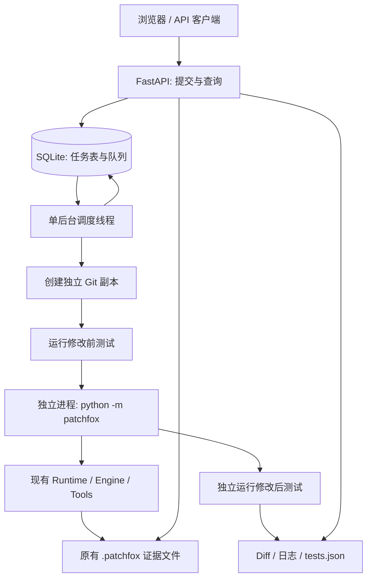

# 本地 Coding Agent 任务工作台

工作台为 PatchFox 增加任务提交、后台执行、状态查询、代码 Diff 和测试结果查看能力。它是一个可选入口，复用现有 Runtime；CLI/TUI 不依赖 FastAPI 或 SQLite 工作台。

第一版面向单用户本机使用：一个服务进程、一个调度线程、一个任务执行槽。任务中的 PatchFox 运行在独立子进程中，HTTP 接口不等待模型调用完成。页面每 1.2 秒刷新状态，不需要 Node.js、Redis、Celery、MCP 或云服务器。

## 启动与最小验收

在 PatchFox 项目目录中安装可选依赖：

```powershell
python -m pip install -e ".[workbench]"
python -m patchfox.workbench --demo
```

也可使用安装后的 `patchfox-workbench --demo`。打开 <http://127.0.0.1:8765>。

演示使用 **ScriptedModelClient 预设模型输出**，不调用真实模型，不消耗 API 额度。实际运行的是 PatchFox Engine、工具参数校验、权限链、文件读写和证据落盘。该演示验证工作台集成，不用于衡量模型修复能力。

1. 页面显示“离线验收模式”，自动填入运费边界条件任务。
2. 点击“提交任务”，立即得到任务 ID，任务进入队列。
3. 工作台将样例仓库克隆到独立任务目录，先运行 `python -m unittest -v`。
4. 修改前：3 个测试中边界测试失败，退出码为 1。
5. 真实 Runtime 执行 `read_file`、`patch_file`，将 `total > 100` 改为 `total >= 100`。
6. 修改后：3 个测试全部通过，退出码为 0。
7. 页面显示“已完成”、2 次工具执行、1 个修改文件；Diff 显示上述一行变化。
8. 刷新页面或正常停止并重新启动服务，仍可查看任务和产物；样例源仓库仍保留原来的缺陷。

默认数据位于 `~/.patchfox/workbench/`，用 `--data-dir` 可指定其他路径。重复启动演示不会覆盖已有样例仓库。

## 使用真实模型和自己的仓库

```powershell
python -m patchfox.workbench --repo "F:/project/demo-repo" --test-command "python -m pytest -q"
```

需要提前通过原有 `patchfox config init` 配置模型。工作台默认沿用全局 Provider 配置/进程环境变量；如需指定模型，可在启动时增加 `--provider <profile> --model <model>`。任务副本路径不同于源仓库，因此原仓库在 `projects.json` 中的模型选择不会自动继承，应用启动参数可显式固定。

注意：

- 源仓库必须有提交且工作区干净。未提交的修改不会自动纳入任务；API 会返回明确错误。
- 可以重复使用 `--repo` 注册多个仓库。API 只能选择注册的仓库，不能提交任意服务器路径。
- 每个任务固定提交 SHA，生成独立 clone；即使后续源仓库 HEAD 改变，任务仍检出记录的 SHA。
- 不自动合并、提交或回写修改到源仓库。检查 `patch.diff` 和测试后，用户自行决定如何接受变更。
- 项目依赖需预先可用。默认使用启动工作台的 Python 环境；`python`/`python3` 验收命令指向该解释器。第一版不自动创建项目 venv、安装依赖或拉取 SWE-bench 镜像。
- `--test-command` 按参数解析后直接运行，不通过 Shell，不能使用 `&&`、管道等语法。Windows 带空格路径建议使用正斜杠并按参数引用，或把步骤写进脚本后直接执行脚本。
- 未配置验收命令时，测试明确显示“未运行”。Agent 返回完成不等于功能已通过测试。
- 默认 Agent 超时 900 秒，可用 `--timeout` 调整；每次独立验收最多 120 秒。
- 使用 `--approval auto --sandbox best_effort`，执行过程无需终端确认。在 Windows 上通常没有 bubblewrap；独立 Git 副本用于隔离任务改动，**不是系统级安全沙箱**。仅对自己信任的本地仓库使用，命令仍拥有当前用户的系统权限。
- 仅监听 `127.0.0.1`，没有账号、租户和公网鉴权。不要通过反向代理或端口转发公开它。

## 架构与调用链



`patchfox/workbench/service.py` 负责调度和进程生命周期，`app.py` 提供 HTTP 接口。核心 Engine、Memory、工具协议及其评测算法没有为工作台重写。

真实模式通过已有 CLI 的 `--prompt-file`、`--session-id` 和 `--non-interactive` 调用 Runtime。每个任务使用唯一 session ID；工作台从该 session 的 `turn_started` 事件找到主 run，不用“最新报告”猜测，因此不会把子 Agent 的报告误当成主任务报告。

## 哪些放 SQLite，哪些继续用文件

| 数据 | 存放位置 | 原因 |
| --- | --- | --- |
| 任务 ID、名称、请求、源仓库、基线 SHA | SQLite `tasks` 表 | 查询任务与复现输入 |
| 状态、阶段、创建/开始/结束时间 | SQLite | 队列管理与历史列表 |
| 步数上限、验收命令、Provider/模型名称、演示/真实模式 | SQLite | 固定任务执行配置；不存 API Key |
| 主 run ID、停止原因、错误、进程退出码、测试状态 | SQLite | 汇总结果与定位文件 |
| 请求及配置快照 | `request.json` / `prompt.txt` | 在任务目录内保留自包含输入 |
| Session、Task State、Trace、Report、Memory | 副本内原有 `.patchfox/` 文件 | 继续由 Runtime 管理，不迁移旧协议 |
| 完整代码修改与文件清单 | `patch.diff` / `changes.json` | 适合文件比较与导出 |
| 修改前后命令、真实退出码、耗时 | `tests.json` | 可核验的结构化测试产物 |
| Agent / Git 准备 / 测试输出 | `*.log` | 追加写入和查看，不把大文本塞进任务表 |

页面日志和 Diff 有展示大小上限，完整产物保留在本机文件中。SQLite 使用 WAL 和短事务；原子领取任务后才执行耗时操作，不在数据库事务中等待模型。

```text
~/.patchfox/workbench/
├── tasks.sqlite3                  # 任务索引与队列
├── service.lock                   # 防止同目录启动两个调度器
├── demo-repo/                     # 仅 --demo 创建
└── tasks/<task-id>/
    ├── request.json / prompt.txt
    ├── setup.log / checkout.log
    ├── agent.log / execution.json
    ├── tests-before.log / tests-after.log / tests.json
    ├── patch.diff / changes.json
    └── workspace/                 # 独立仓库副本
        └── .patchfox/
            ├── sessions/wb_<task-id>.json
            ├── sessions/wb_<task-id>.events.jsonl
            ├── runs/<run-id>/...
            └── memory/...
```

## 状态与结果判定

任务状态：`queued → running → succeeded / failed / stopped / interrupted`。

`running` 期间阶段依次为准备、基线测试、Agent 执行、独立验收。没有配置验收时跳过对应阶段。HTTP 提交返回 202，状态查询随时可用。

- CLI 退出码非零、超时、缺失主任务报告、Runtime `model_error`：失败。
- Runtime 达到步数上限或其他停止条件：提前停止，即使 CLI 返回 0 也不算完成。
- Runtime 正常完成，但独立验收命令失败：任务失败；仍展示已有 Diff。
- Runtime 正常完成，配置的验收命令通过：已完成。
- Runtime 正常完成，未配置验收命令：已完成，但测试状态始终是“未运行”。

验收通过只代表指定命令检查通过，不是 SWE-bench Resolved Rate，也不证明所有需求正确。测试文件在同一任务副本内，Agent 可能修改它们；页面会展示这些变更，因此不能把此模式视为隐藏测试评分。

关闭浏览器不影响后台任务。正常停止服务时会终止正在执行的进程树，任务标记为中断；排队任务持久保留，下次启动继续领取。服务重启时旧的 `running` 任务标为 `interrupted`，**不自动重放**。强制结束服务进程或系统崩溃后，可能需要人工检查残留子进程；第一版没有跨进程崩溃恢复或断点续跑协议。

## API

| 方法 | 路径 | 用途 |
| --- | --- | --- |
| GET | `/api/config` | 注册仓库、模式、验收命令 |
| POST | `/api/tasks` | 提交任务，返回 202 和任务 ID |
| GET | `/api/tasks` | 最近 100 条任务 |
| GET | `/api/tasks/{id}` | 状态、主 run、结果、文件索引 |
| GET | `/api/tasks/{id}/artifacts/{name}` | `diff`、`agent`、`before`、`after`、`setup` 文本 |

提交示例：

```json
{
  "repository_id": 0,
  "title": "修复边界条件",
  "prompt": "修复 shipping_fee：100 元也应免运费，不修改测试。",
  "max_steps": 30
}
```

## 开发验证

```powershell
python -m pip install -e ".[workbench]" pytest httpx
python -m pytest tests/test_workbench.py -q
```

回归覆盖真实 Runtime 子进程演示、前后测试、源仓库不变、重启持久化、原子取任务、单实例锁、完整 Diff、CLI 返回 0 但 Runtime/验收失败、缺失报告、超时，以及 API 来源/仓库边界。后续扩展应优先由真实使用需求驱动，例如任务取消、指定项目解释器、可信验收文件或运行环境隔离。
